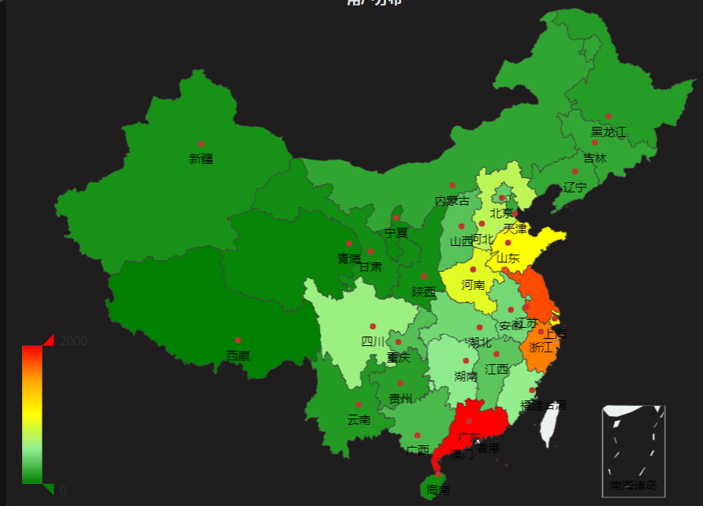

## Chinamap Panel Plugin for Grafana

基于Echarts2开发




## Grafana前端源码修改
Grafana前端模块化方案见[Systemjs](https://github.com/systemjs/systemjs);
其前端用到的模块资源都放在`$GRAFANA_HOME/public/vendor/`目录中, 资源配置文件`$GRAFANA_HOME/public/app/system.conf.js`;
二次开发时如果项目依赖的模块资源官方没有提供则需要将依赖模块文件添加到vendor目录中，且在system.conf.js中进行配置

- 安装配置好开发环境: node.js v6.11.2/ npm / grunt
- Github上Fork Grafana官方源码(注意版本, 本示例用的4.1.x), 并clone到本地
- `$GRAFANA_HOME/public/vendor`目录下新建echarts目录, 从Echarts2官方下载echarts.min.js和china.js 放入该目录
- 修改 `$GRAFANA_HOME/public/app/system.conf.js`
	```javascript
		...... 上面还有一堆配置 ......
	"jquery.flot.fillbelow": "vendor/flot/jquery.flot.fillbelow",
	    "jquery.flot.gauge": "vendor/flot/jquery.flot.gauge",
	    "echarts": "vendor/echarts/echarts.min.js",
	    "china": "vendor/echarts/china.js"
	```
- 重新打包: 在grafana根目录执行grunt即可，执行完如果没有报错会生成一个新的目录public_gen
	据网友反映grunt打包后前端加载的资源变很多, 这里记得要压缩合并前端资源
- 测试: 将public_gen目录替换到grafana安装包里的public目录启动服务即可


## 插件安装
- 将本实例clone到你的plugins目录后重新启动grafana服务即可

## 时间序列数据作为数据源

支持数据源:

- Elasticsearch


包括的位置数据:

- 省份 
- 城市（暂时不支持展示）


## 查询示例

**ES**


**Metrics**


**China Map**


## 附录
- [官方开发指南](http://docs.grafana.org/plugins/developing/development/)
- [官方示例插件](https://github.com/grafana/piechart-panel)